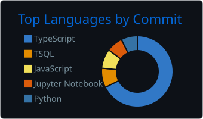
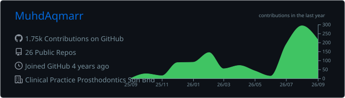

<!-- Header -->

  

<h2 align="center">Hi 👋, I'm Aqmar</h2>

  <b>Fullstack Developer</b> 
  

  Building end-to-end business systems, from staff dashboards to patient apps, with AI baked in, not bolted on.

---

### 🚀 About Me

<table>
<tr>
<td width="60%" valign="top">

**Aqmar** here, a fullstack developer at **Clinical Practice Prosthodontics Sdn Bhd**, where I build **DentalHub**, a fully internal platform for **Dr Kamsiah Dental Clinic**, covering everything from staff operations to the patient app.

I work with an **AI agentic workflow** day to day: agents plan, code and review alongside me, and most of what I ship talks to **AI APIs** directly.

I care about two things: **systems that actually run the business**, and **interfaces that feel alive**. That's why my projects lean on GSAP, Lenis, Motion and React Three Fiber.

Outside the product work I dabble in **data engineering** (Kafka, Spark, data warehousing) and **ML** (CNNs with TensorFlow/Keras).

</td>
<td width="40%" align="center">

</td>
</tr>
</table>

---

### 🦷 Currently Building: DentalHub

> One platform for the whole clinic, from staff to patients, with AI automation at the core.

| Module | What it does |
|---|---|
| 🤖 **AI Outreach** | Omnichannel patient messaging in the spirit of respond.io, but AI-first: auto-replies, appointment reminders, follow-ups and lead handling |
| 🧑‍⚕️ **Staff Portal** | Internal operations and day-to-day clinic workflows |
| 📱 **Patient App** | Bookings, reminders and patient self-service |
| 👥 **HR Module** | Staff management and HR workflows |
| 💰 **Accounting Module** | Billing, invoicing and clinic finance |
| 🧠 **AI Layer** | LLM API integrations across modules for automation and decision support |

---

### 🛠️ Featured Projects

| Project | Stack | What it is |
|---|---|---|
| 👻 [**HantuHarga**](https://github.com/MuhdAqmarr/HantuHarga) | Next.js • Supabase • OpenAI • R3F | Community price intel for Malaysia. GPT-4o reads scanned receipts to crowdsource grocery prices. *Krackeddev Hackathon 2026* |
| ✨ [**LumiSpace**](https://github.com/MuhdAqmarr/LumiSpace) | Next.js • GSAP • Three.js • Lenis | Cinematic, Awwwards-inspired multi-provider venue booking marketplace |
| 🎨 [**MatchLab**](https://github.com/MuhdAqmarr/Smart-Personal-Colour-Analysis-System) | TypeScript • CIE Lab | Final-year project: personal colour analysis from a face photo with an image-quality gate and explainable results |
| 📖 [**Quran Explorer**](https://github.com/MuhdAqmarr/quran-reader) | Next.js • TanStack Query • Zustand | Modern digital Quran: KFGQPC mushaf, Malay translation, tafsir and multi-qari audio with ayah sync |
| 🏙️ [**CivicPulse**](https://github.com/MuhdAqmarr/CivicPulse) | Next.js • Supabase • Mapbox | Local community problem reporter |
| 🌊 [**A Rising Reality**](https://github.com/MuhdAqmarr/rising-reality) | GSAP ScrollTrigger • Lenis • SplitType | Six-scene scrollytelling experience on climate change |
| 🍽️ [**Rembayung**](https://github.com/MuhdAqmarr/Rembayung) | Next.js • Supabase • GSAP • R3F | Restaurant site and booking for KA Restaurant |
| 🚗 [**Parking Booking System**](https://github.com/MuhdAqmarr/Parking-Booking-System) | React • Express • TypeORM • Oracle • Stripe | Campus parking reservations with real-time availability and admin dashboard |
| 📈 [**Stock Streaming Dashboard**](https://github.com/MuhdAqmarr/stock-streaming-dashboard) | Kafka • Spark • Cassandra • Grafana | Real-time streaming pipeline for live stock trades |

---

### 🤝 Connect

  &nbsp;
  &nbsp;
  

---

### 💻 Tech Stack

**Frontend & Creative**

   
  
  
  
  
  
  
  
  
  

**Backend & Data**

   
  
  
  
  
  

**AI, ML & Data Engineering**

   
  
  
  
  
  
  
  

**Cloud, Testing & Tools**

   
  
  
  

---

### 📊 GitHub Stats

  

### 📈 Activity Graph

  

---

  

